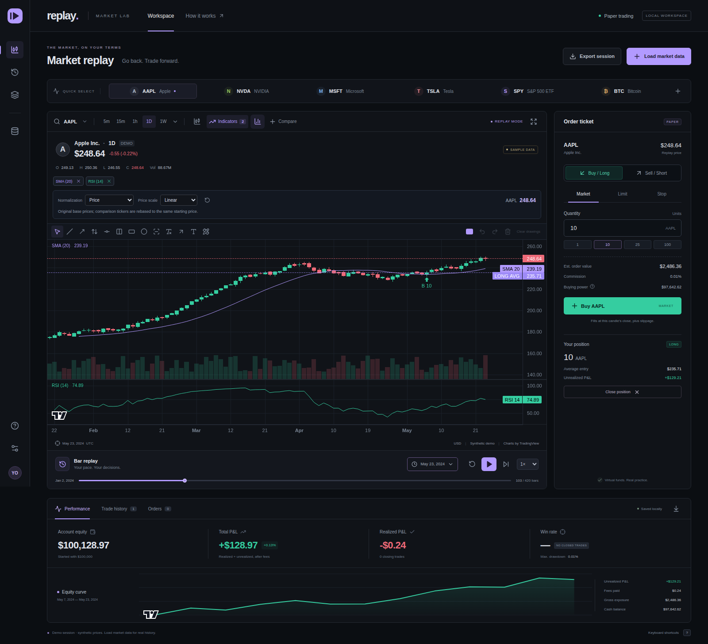
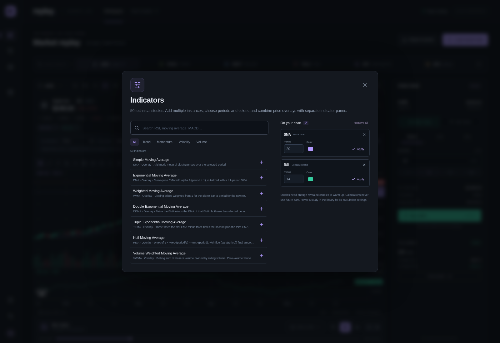
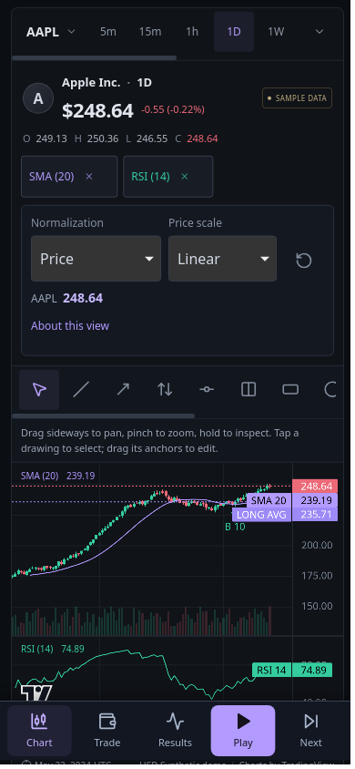
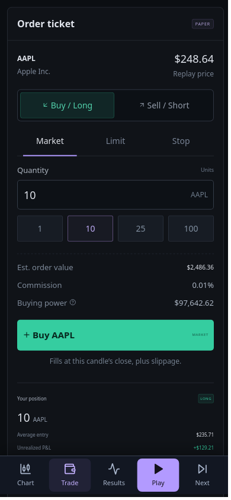

# Replay

[](https://github.com/aunkay/replay/actions/workflows/e2e.yml)
[](LICENSE)

A self-hosted market replay and paper trading app. Load historical prices, reveal candles one at a time, practice entries and exits, and review your P&L. Built with React, TypeScript, TradingView Lightweight Charts, FastAPI, and yfinance.



*Screenshots show the app's labeled synthetic demo data and simulated trades. They do not represent actual market prices or investment results.*

## Features

- **Historical data:** choose a Yahoo Finance ticker, interval, and period or date range. No API key required.
- **Candle replay:** play, pause, adjust speed, step, and seek. The chart follows the latest candle while you are at the right edge; browsing earlier history preserves your view.
- **Paper trading:** market, limit, and stop orders; long and short positions; configurable capital, commissions, and slippage.
- **Performance:** realized and unrealized P&L, equity, cash, exposure, returns, drawdown, order history, and CSV exports.
- **50 technical indicators:** searchable menu, multiple instances, configurable periods and colors, overlays and oscillator panes.
- **12 drawing tools:** trendlines, rays, horizontal and vertical lines, Fibonacci tools, and more, with undo and redo.
- **Compare up to five tickers:** one base instrument plus four comparison tickers, using the same interval. Keep the base price readout alongside normalized comparisons.
- **Flexible scales:** price, percentage, indexed-to-100, ratio, log return, z-score, and min–max normalization, plus logarithmic price spacing where applicable.
- **Mobile layout:** touch controls, an iPhone 13 browser test suite, and a SwiftUI/WKWebView starter for a future self-hosted iOS app.
- **Local persistence:** session and chart settings survive a reload in the same browser.

This is a manual replay/backtesting workspace. It does not execute Pine Script strategies or connect to a live broker.

## Quick start

Install **Node.js 22+**, **Python 3.11+**, and Git. On Linux or macOS:

```bash
git clone https://github.com/aunkay/replay.git
cd replay
npm ci
python3 -m venv .venv
.venv/bin/python -m pip install -r requirements.txt
./scripts/dev.sh
```

Open **[http://localhost:5173](http://localhost:5173)**. The launcher starts the frontend and API together; Ctrl+C stops both. The initial synthetic demo is ready immediately. Loading real historical data requires an internet connection to Yahoo Finance.

<details>
<summary>Run the services separately (including Windows)</summary>

Create the virtual environment and install dependencies first. Run these commands in separate terminals from the repository root:

```bash
# API — Linux/macOS
.venv/bin/python -m uvicorn backend.main:app --reload --host 127.0.0.1 --port 8000

# Frontend
npm run dev -- --port 5173 --strictPort
```

On Windows, use `python -m venv .venv`, then `.venv\Scripts\python.exe` in place of `.venv/bin/python` for installation and the API command. Vite proxies `/api` requests to the backend on port 8000.

</details>

## Try a replay

1. Explore the demo or open **Load market data** and choose a ticker such as `AAPL`, `SPY`, or `BTC-USD`.
2. Choose an interval and date range, then load the candles.
3. Open **Indicators** to add studies, or add comparison tickers and choose a normalization mode.
4. Set your quantity and order type, place a simulated buy or sell, then advance the replay.
5. Review performance and export your session as CSV.

Only revealed candles are available to the simulation. Seeking forward processes the intervening candles; rewinding or replacing the dataset resets the paper account. See the [user guide](docs/user-guide.md) for fill rules, fees, normalization formulas, indicators, and drawing tools.

## Screenshots

### Indicator menu



### iPhone layout

<p>
  
  
</p>

Captured from the running app in Chromium and iPhone 13 WebKit emulation. The native iOS starter has not been validated in Xcode or on a physical device.

## Self-hosting

Build the frontend, then start the backend to serve both the UI and API from one origin:

```bash
npm run build
.venv/bin/python -m uvicorn backend.main:app --host 127.0.0.1 --port 8000
```

Open [http://127.0.0.1:8000](http://127.0.0.1:8000). The `dist/` build must exist when the backend starts. For remote access, put this service behind an HTTPS reverse proxy. See the [hosting and iOS WebView guide](docs/ios-webview.md) for deployment details and the [SwiftUI starter](ios/ReplayApp.swift).

The app has no built-in user authentication. Keep personal deployments private or add authentication at the reverse proxy. Browser storage is local to each device and origin; there is no account synchronization.

## Development and tests

```bash
npm test                                  # Unit tests
.venv/bin/python -m pytest backend/tests -q # API tests
npm run test:e2e:types                     # Browser-test type checks
npm run build                             # Type checks and production bundle
npx playwright install --with-deps chromium webkit
npm run test:e2e                           # Desktop and iPhone browser tests
npm run test:e2e:iphone                    # iPhone suite only
```

GitHub Actions runs the checks and browser journeys on pushes and pull requests. Tests cover replay, orders, indicators, drawings, comparisons, normalization, persistence, and mobile interactions.

To regenerate the README screenshots, start the app on port 5173 and run `npm run screenshots`. Set `SCREENSHOT_BASE_URL` to use a different local address. Captures use fresh browser contexts and synthetic demo data.

| Path | Contents |
| --- | --- |
| `src/` | React workspace, chart tools, indicators, and paper trading engine |
| `backend/` | FastAPI service, yfinance integration, and API tests |
| `tests/` | Playwright browser journeys |
| `ios/` | SwiftUI/WKWebView starter |
| `docs/user-guide.md` | Detailed usage and simulation behavior |
| `docs/ios-webview.md` | Hosting and iOS integration |

Bug reports and pull requests are welcome. Include reproduction steps, browser/device details, and the ticker/interval involved; use synthetic data for reproducible tests where possible.

## Data and licensing

Yahoo Finance availability, rate limits, and historical intraday coverage vary. Provider errors are shown explicitly; failed requests never silently switch to demo data. Consult [yfinance's documentation and data-use terms](https://ranaroussi.github.io/yfinance/) before using downloaded data. Simulated fills use candle data and cannot reproduce real-world execution.

Replay is licensed under the [MIT License](LICENSE). Third-party dependencies retain their own licenses; see [third-party notices](THIRD_PARTY_NOTICES.md).

Charting uses [TradingView Lightweight Charts™](https://github.com/tradingview/lightweight-charts), licensed under Apache 2.0. Replay is an independent project and is not affiliated with TradingView or Yahoo Finance.
