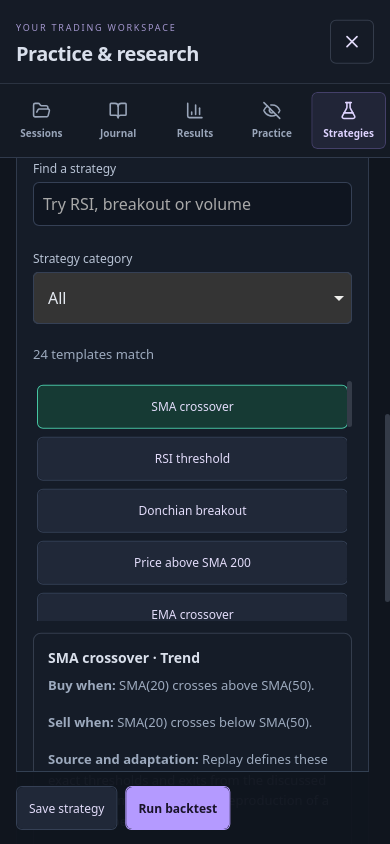

# Strategy catalog and quick backtests

Replay includes 24 editable, long-only strategy templates under **Practice & research → Strategy lab → Choose a starting point**. Search by name or filter by trading style. Selecting a template replaces the rules and sizing defaults. Each choice explains its entry, exit, source and differences from the source discussion.

These are **documented research ideas, not 24 proven profitable systems**. Several sources discuss indicators rather than fully specified strategies; Replay supplies exact thresholds and exits and labels those adaptations. A Reddit performance claim is not independently audited evidence. The reference study tests all templates without removing losers or tuning parameters.



## What is included

| Family | Templates | r/algotrading research |
| --- | --- | --- |
| Moving averages | SMA 20/50 crossover, price above SMA 200, EMA 12/26 crossover | [MA crossover discussion](https://www.reddit.com/r/algotrading/comments/1ov3g5r/) |
| RSI | RSI 14 threshold, Connors RSI 4 pullback | [RSI 4 entry/exit rules](https://www.reddit.com/r/algotrading/comments/15qiymg/) |
| Channels | Donchian breakout, Keltner breakout | [Donchian/SMA/ADX](https://www.reddit.com/r/algotrading/comments/1s7eqm7/), [Keltner events](https://www.reddit.com/r/algotrading/comments/1q67agf/) |
| Bollinger bands | Momentum breakout, mean reversion | [Breakout backtest](https://www.reddit.com/r/algotrading/comments/1lka4qh/), [trend/range discussion](https://www.reddit.com/r/algotrading/comments/gkcnod/) |
| Direction and trend | ADX directional trend, Ichimoku conversion/base, Supertrend reversal | [ADX tests](https://www.reddit.com/r/algotrading/comments/1irhrcw/), [Ichimoku](https://www.reddit.com/r/algotrading/comments/gkcnod/), [Supertrend timing](https://www.reddit.com/r/algotrading/comments/1e6kdrq/) |
| Momentum | MACD signal crossover, CCI impulse, rate-of-change momentum | [MACD combinations](https://www.reddit.com/r/algotrading/comments/171h9aq/), [CCI discussion](https://www.reddit.com/r/algotrading/comments/1k9zi45/), [momentum indicators](https://www.reddit.com/r/algotrading/comments/1kumqhg/) |
| Additional indicator families | Parabolic SAR, stochastic recovery, Williams R recovery, Chaikin money flow trend, money flow oversold, Aroon switch, true strength momentum, Ultimate oscillator recovery, Stochastic RSI pullback | [Indicator rule catalog and overfitting discussion](https://www.reddit.com/r/algotrading/comments/1b82n6u/). These nine are Replay-authored rule adaptations of listed indicator families, not nine exact published systems. |

The app displays the executable rule explanations. [Template definitions](../src/lib/strategyTemplates.ts) contain every threshold, indicator output and offset. Donchian channels exclude the signal candle. Ichimoku uses conversion/base only, without displaced cloud signals. All signals use completed bars and execute at the next open. No source's reported performance is presented as Replay's performance.

## Reference study

Open **Historical quick tests · P&L, drawdown & Sharpe** inside the starting-point section. Choose SPY, QQQ or GLD and either 2016–2020 or 2021–2025. This static reference study is separate from a backtest on the chart currently loaded. The table includes all 24 strategies plus a matched buy-and-hold baseline, giving **150 evaluations**.

- Adjusted daily yfinance OHLCV fetched from Replay's existing API, which shares the provider spacing/backoff gate. Data begins in 2015 for warmup; trading begins in each stated evaluation window.
- Fresh $100,000 account for every ticker/window; 95% of current equity allocated at each entry, with fractional shares rounded down to six decimals. Allocation includes entry costs and stays below available cash.
- 5 bps commission and 5 bps slippage **each side**. Long only, one position, no pyramiding, leverage, stops or targets. Rule-based exits; remaining positions close at the final candle close.
- Buy-and-hold uses the same entry allocation, costs, first evaluation open and final close. It leaves the same initial cash reserve.
- Net P&L includes execution costs. Return is net P&L / initial capital. Maximum drawdown uses marked account equity at candle closes, including initial capital; it does not capture worst intraday excursions.
- Sharpe uses simple equity returns including idle cash, sample standard deviation, zero risk-free rate and square-root annualization. The reference study uses 252 daily periods/year. See [William Sharpe's original discussion](https://web.stanford.edu/~wfsharpe/art/sr/SR.htm). Serial dependence can make annualization misleading.
- In custom runs, intraday marks are resampled to their final UTC daily value, retaining the initial capital baseline so the first partial day’s P&L and costs are included. Native weekly/monthly data use 52/12 periods/year, inferred from median spacing. Select 365 days/year for daily crypto. A single day, too few observations, constant returns or nonpositive equity yields N/A, never an infinite score. This is UTC sampling, not exchange-session resampling.

The later sample is a chronological robustness check, **not a genuinely unseen or preregistered holdout**: source ideas were published after some of this history. The three currently surviving ETFs do not constitute a survivorship-free universe. Comparing 24 strategies creates selection bias. Adjusted prices approximate distributions; taxes, cash yield, liquidity constraints and market impact beyond fixed slippage are omitted. Test more markets and regimes and paper trade before relying on a strategy. No strategy was selected or removed based on these results.

For example, SPY in 2021–2025 returned 62.17% with 12.06% maximum drawdown and 1.00 Sharpe for EMA crossover, versus 89.54%, 23.54% and 0.86 for matched buy-and-hold. Lower drawdown did not imply higher total profit. The complete [CSV results](strategy-research.csv) preserve negative and zero-trade outcomes too.

## Reproduce or audit

```bash
# Requires the running Replay API (default localhost:8080)
npm run research:strategies

# Optional: fresh cache and a different API
RESEARCH_CACHE=/tmp/replay-fresh-study RESEARCH_API_URL=http://localhost:8080 npm run research:strategies
```

The runner makes three sequential data requests via Replay, fails on provider/data errors or rejected orders, and never substitutes demo data. A throttle error stops the study; rerun after the provider cooldown. Intermediate OHLCV stays in the local cache outside the repository. Yahoo may revise adjusted prices, so refetching can produce different results.

[The generated JSON](../src/data/strategy-research.json) records strategy definitions, engine version, data hashes, retrieval timestamps, evaluation dates, assumptions and all results. [The runner](../scripts/strategy-research.ts) uses the same TypeScript execution engine as the app's server workers. Both JSON and CSV are generated together; rebuild/deploy the UI after regenerating. Cached data is reused unless a new cache directory is selected.

Custom runs now save Sharpe information and engine version 3. Older runs remain readable and show N/A for missing Sharpe; rerun them to calculate it. Saved strategies without equity allocation retain their previous fixed-quantity or risk-based sizing.
